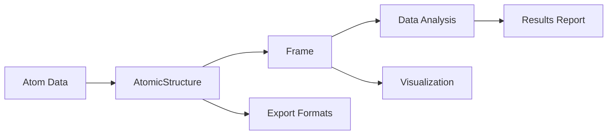

# MolPy Documentation

Welcome to MolPy - a powerful Python framework for molecular modeling, simulation, and analysis.

## 📚 Documentation Structure

### 🚀 Getting Started
- **[Core Structures Guide](core_structures_guide.md)** - Essential concepts and quick start
- **[Installation & Setup](index.md)** - Installation instructions and basic setup

### 📖 Tutorials
- **[Struct Tutorial](tutorials/struct_complete_tutorial.md)** - Complete guide to molecular building
- **[Frame Tutorial](tutorials/frame_complete_tutorial.md)** - High-performance data operations

### 📋 Reference
- **[ForceField Guide](api/forcefield_guide.md)** - Comprehensive force field system guide
- **[ForceField API Reference](api/forcefield_reference.md)** - Complete force field API documentation
- **[API Reference](api/api_reference.md)** - Complete API documentation
- **[Examples Collection](examples/examples_collection.md)** - Practical code examples

### 🗂️ Additional Resources
- **[Legacy/Archive](archive/)** - Old versions and alternative implementations

---

## 🎯 Quick Navigation

### For New Users
1. Read the [Core Structures Guide](core_structures_guide.md) to understand MolPy's architecture
2. Follow the [Struct Tutorial](tutorials/struct_complete_tutorial.md) to learn molecular building
3. Try examples from the [Examples Collection](examples/examples_collection.md)

### For Data Scientists
1. Start with [Frame Tutorial](tutorials/frame_complete_tutorial.md) for efficient data handling
2. Check [API Reference](api/api_reference.md) for advanced features
3. Review performance examples in the tutorials

### For Developers
1. Study the [API Reference](api/api_reference.md) for implementation details
2. Run the test suite: `pytest tests/test_core/ -v`
3. Contribute following the patterns in existing code

---

## 🔧 Key Features

### Struct Module - Object-Oriented Molecular Building
```python
import molpy as mp

# Create water molecule
water = mp.AtomicStructure(name="water")
o = water.def_atom(name="O", element="O", xyz=[0, 0, 0])
h1 = water.def_atom(name="H1", element="H", xyz=[0.757, 0.586, 0])
h2 = water.def_atom(name="H2", element="H", xyz=[-0.757, 0.586, 0])

# Add bonds and analyze
water.def_bond(o, h1, bond_type="covalent")
water.def_bond(o, h2, bond_type="covalent")
print(f"Formula: {water.molecular_formula()}")
```

### Frame Module - High-Performance Data Operations
```python
# Efficient data analysis
frame = mp.Frame(
    atoms={
        'name': ['O', 'H1', 'H2'],
        'element': ['O', 'H', 'H'],
        'xyz': [[0,0,0], [0.757,0.586,0], [-0.757,0.586,0]],
        'charge': [-0.834, 0.417, 0.417]
    }
)

# Vectorized operations
coords = frame['atoms'].coords['xyz'].values
center = np.mean(coords, axis=0)
distances = np.linalg.norm(coords - center, axis=1)
```

---

## 🛠️ Development & Testing

### Running Tests
```bash
# Core functionality tests
pytest tests/test_core/test_struct_simplified.py -v

# All tests
pytest tests/test_core/ -v
```

### Building Documentation
```bash
# Serve documentation locally
mkdocs serve

# Build static documentation
mkdocs build
```

---

## 🤝 Contributing

We welcome contributions! Here's how to get started:

1. **Documentation**: Improve tutorials, add examples, fix typos
2. **Code**: Add features, fix bugs, improve performance
3. **Testing**: Add test cases, improve coverage
4. **Examples**: Create real-world use cases

### Code Style
- Follow existing patterns in the codebase
- Add docstrings to new functions and classes
- Include type hints where appropriate
- Write tests for new functionality

---

## 📞 Support & Community

- **Issues**: Report bugs and request features via GitHub issues
- **Questions**: Check existing documentation and examples first
- **Contributing**: See individual files for contribution guidelines

---

## 📝 Version Information

- **Current Version**: 1.0.0
- **Python Support**: 3.8+
- **Key Dependencies**: NumPy, xarray, pandas (optional)

---

*This documentation is actively maintained. Last updated: June 2025*
1. Deep dive into [Complete Frame Tutorial](frame_complete_tutorial.md)
2. Master data conversion and analysis techniques
3. Learn hierarchical structure management and batch operations
4. Reference [API Documentation](api_reference.md) for advanced development

### Developer Path
1. Study comprehensive [API Reference](api_reference.md)
2. Analyze [Test Suite](../tests/test_core/test_struct_simplified.py)
3. Learn performance optimization techniques
4. Contribute code and documentation

---

## 🔧 Core Features Overview

### Struct Module
```python
import molpy as mp

# Create molecular structure
water = mp.AtomicStructure(name="water")
o = water.def_atom(name="O", element="O", xyz=[0, 0, 0])
h1 = water.def_atom(name="H1", element="H", xyz=[0.757, 0.586, 0])
h2 = water.def_atom(name="H2", element="H", xyz=[-0.757, 0.586, 0])

# Add bonds and angles
water.def_bond(o, h1, bond_type="covalent")
water.def_bond(o, h2, bond_type="covalent")
angle = mp.Angle(h1, o, h2, angle_type="bent")
water.add_angle(angle)
```

### Frame Module
```python
# Create efficient data Frame
frame = mp.Frame(
    atoms={
        'name': ['O', 'H1', 'H2'],
        'element': ['O', 'H', 'H'],
        'xyz': [[0,0,0], [0.757,0.586,0], [-0.757,0.586,0]],
        'charge': [-0.834, 0.417, 0.417]
    }
)

# Data analysis and transformation
coords = frame['atoms'].coords['xyz'].values
center = np.mean(coords, axis=0)
```

---

## 📊 Features

### ✅ Implemented Features

#### Core Data Structures
- [x] Entity base class: Flexible dictionary-style data storage
- [x] SpatialMixin: Spatial operations and geometric transformations
- [x] Atom class: Atom representation and manipulation
- [x] Bond, Angle, Dihedral: Topological entities
- [x] AtomicStructure: Complete molecular structure
- [x] Frame: Efficient tabular data processing

#### Core Functionality
- [x] Molecular building and editing
- [x] Spatial transformations (translation, rotation, reflection)
- [x] Hierarchical structure management
- [x] Data conversion and analysis
- [x] Batch operations and performance optimization
- [x] Complete test coverage

### 🔄 Data Flow Example



---

## 🛠️ Development and Testing

### Running Tests
```bash
# Run simplified test suite
pytest tests/test_core/test_struct_simplified.py -v

# Run all core tests
pytest tests/test_core/ -v
```

### Documentation Building
```bash
# Build documentation with MkDocs
mkdocs serve

# Or view markdown files directly
```

---

## 🤝 Contributing

### Documentation Contributions
1. Modify or add tutorial content
2. Update API documentation
3. Add example code
4. Improve code comments

### Code Contributions
1. Review test cases to understand expected behavior
2. Follow existing code style
3. Add appropriate docstrings
4. Ensure tests pass

---

## 📞 Getting Help

- **Tutorial Questions**: Check corresponding complete tutorial documentation
- **API Questions**: Reference API documentation
- **Code Questions**: Look at test cases and examples
- **Performance Questions**: Reference best practices sections

---

## 📝 Changelog

### v1.0.0 (Current Version)
- ✅ Complete Struct module implementation
- ✅ Efficient Frame data processing
- ✅ Complete documentation and tutorials
- ✅ Comprehensive test coverage
- ✅ Performance optimization and best practices guide

---

*This documentation is continuously updated. Feedback and suggestions are welcome.*
